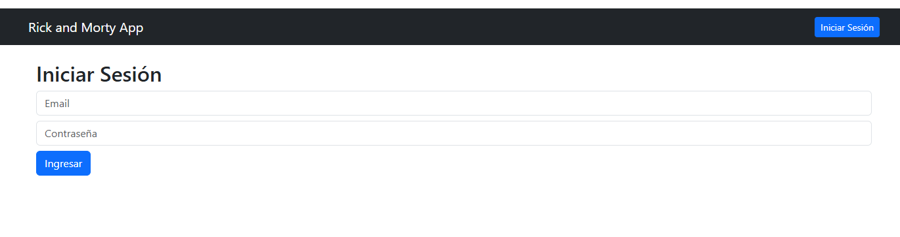

# 🛸 Rick & Morty App - Angular & Node.js 🚀

Un proyecto full-stack desarrollado con **Angular 19 (Frontend)** y **Node.js + Express + MongoDB (Backend)** que permite a los usuarios registrarse, autenticarse, ver personajes de la API de Rick and Morty, agregar favoritos y gestionar su perfil con subida de avatar.  

---

## 📸 **Imágenes del Proyecto**  
🔹 **Pantalla Principal (Listado de Personajes)**  


🔹 **Login y Registro de Usuario**  


🔹 **Vista de Favoritos**  


🔹 **Perfil del Usuario (Subida de Avatar)**  


---

## 🛠 **Tecnologías Utilizadas**
### 🔹 **Frontend (Angular 19)**
- Angular 19 con **Signals** (sin `subscribe()`)
- Bootstrap 5 para diseño responsivo
- Angular Router para navegación
- Consumo de API con **HttpClient**
- LocalStorage para persistencia del token
- Guardias de autenticación con `CanActivate`

### 🔹 **Backend (Node.js + Express)**
- Node.js con Express.js
- MongoDB + Mongoose para persistencia
- JSON Web Token (**JWT**) para autenticación
- Multer para subida de imágenes (Avatares)
- BCrypt para encriptación de contraseñas

---

## 🚀 **Características Principales**
✅ **Autenticación con JWT:** Registro, Login y Persistencia de Sesión.  
✅ **Consumo de API externa:** Se obtienen personajes de la API de Rick & Morty.  
✅ **Favoritos:** Los usuarios pueden marcar personajes como favoritos y ver su lista.  
✅ **Perfil del usuario:** Edición de nombre y subida de avatar con imágenes reales.  
✅ **Protección de Rutas:** Solo usuarios autenticados pueden acceder a favoritos y perfil.  
✅ **Uso de `Signals` en Angular:** Evitamos el uso de `subscribe()` para mayor eficiencia.  

---

## 🎯 **Cómo Instalar y Ejecutar el Proyecto**
📌 **Sigue estos pasos para correr la app en tu máquina.**  

### 🛠 **1️⃣ Clonar el Repositorio**
```sh
git clone https://github.com/TU-USUARIO/rickmorty-app.git
cd rickmorty-app
